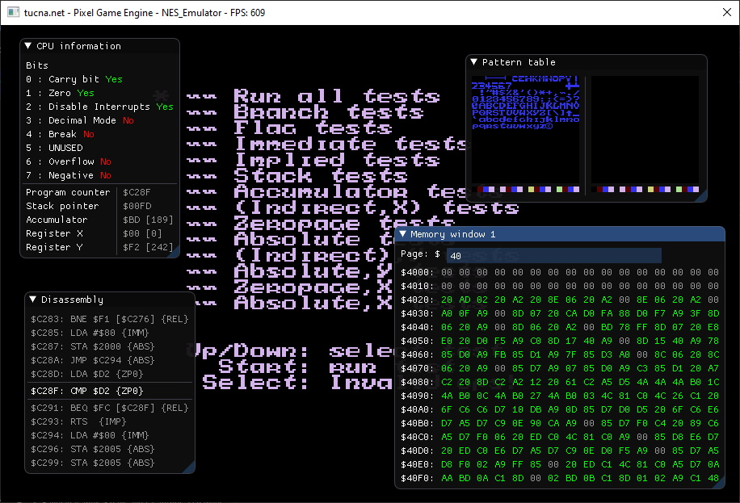
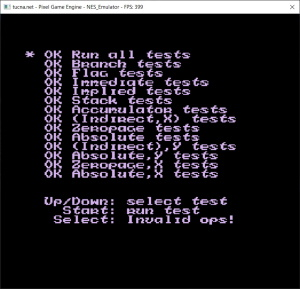
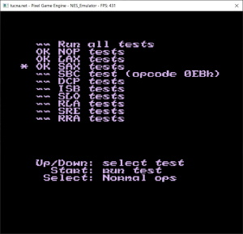

# NES-emulator
Home made NES emulator in C++ and DirectX 11 backend. Still work in progress but already useful.

  
  

The project is built on [tPixelGameEngine](https://github.com/tucna/tPixelGameEngine) and [Dear ImGui](https://github.com/ocornut/imgui)

# Controls

# Features
- Full coverage of CPU official instructions.
- CPU unofficial instructions covered partially.

# Additional information

# Screenshots

  
  &nbsp; &nbsp; &nbsp; &nbsp; &nbsp; &nbsp; &nbsp; 

