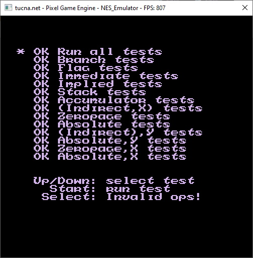
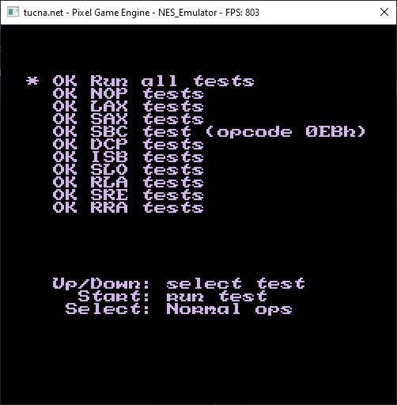

# NES-emulator
Home made NES emulator in C++ and DirectX 11 backend. *Still work in progress but already useful*.

  
  

The project is built on [tPixelGameEngine](https://github.com/tucna/tPixelGameEngine) and [Dear ImGui](https://github.com/ocornut/imgui) for debug purposes. The debug windows show internal state of CPU, disassembled program, GPU pattern tables and palettes and memory starting at specified page.

# Controls
- `X/Z/S/A` - action buttons.
- `Up/Down/Left/Right` - directional buttons.
- `F1` - debug windows.

# Features
- Full coverage of CPU official instructions.
- Full coverage of CPU unofficial instructions.
- PPU partially implemented (background handling).

# Additional information
PPU and CPU implementation are based on Javidx9 [NES emulation](https://github.com/OneLoneCoder/olcNES). Functionality passed [nestest.nes](https://www.nesdev.org/wiki/Emulator_tests) (official/unofficial CPU instructions) and all of the [branch_timing_tests](https://www.nesdev.org/wiki/Emulator_tests).

# Screenshots

  
  &nbsp; &nbsp; &nbsp; &nbsp; &nbsp; &nbsp; &nbsp; 

